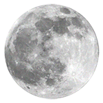
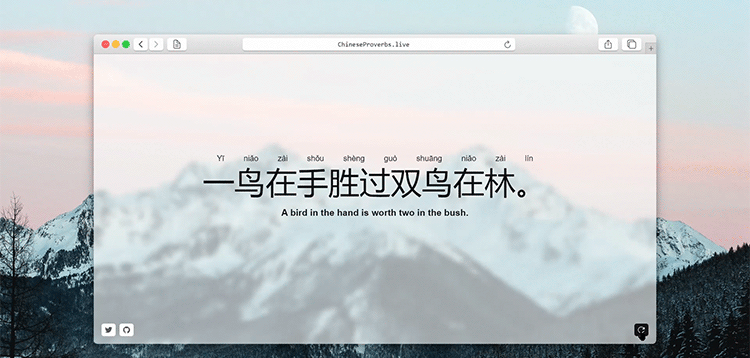

<!-- PROJECT LOGO -->
 

  

  <h3 align="center">Chinese Proverbs | 汉语谚语</h3>

  

    1st certification project assigned by freeCodeCamp as part of the Front End Development Libraries Projects Curriculum
     
     
    <a href="https://freecodecamp-quote-machine.vercel.app/">Live Demo</a>
  

<!-- ABOUT THE PROJECT -->

## About The Project

 

    Objective: Build an app that is functionally similar to this: https://random-quote-machine.freecodecamp.rocks/.

## Built With

